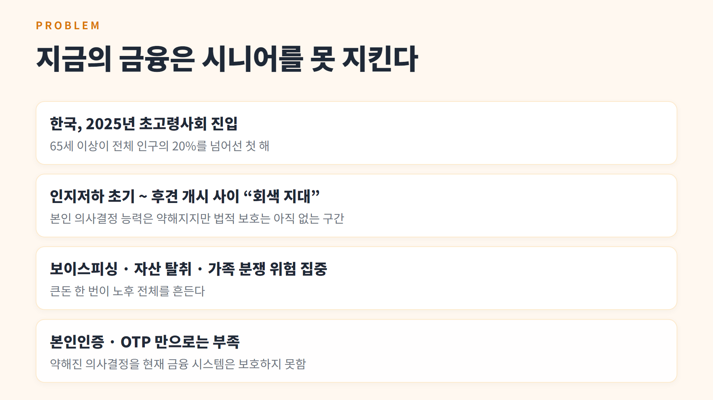
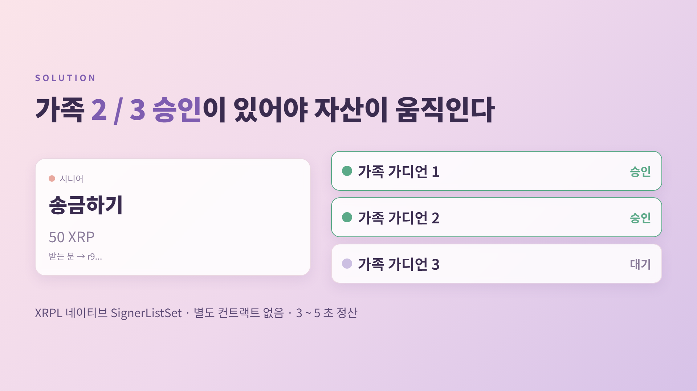
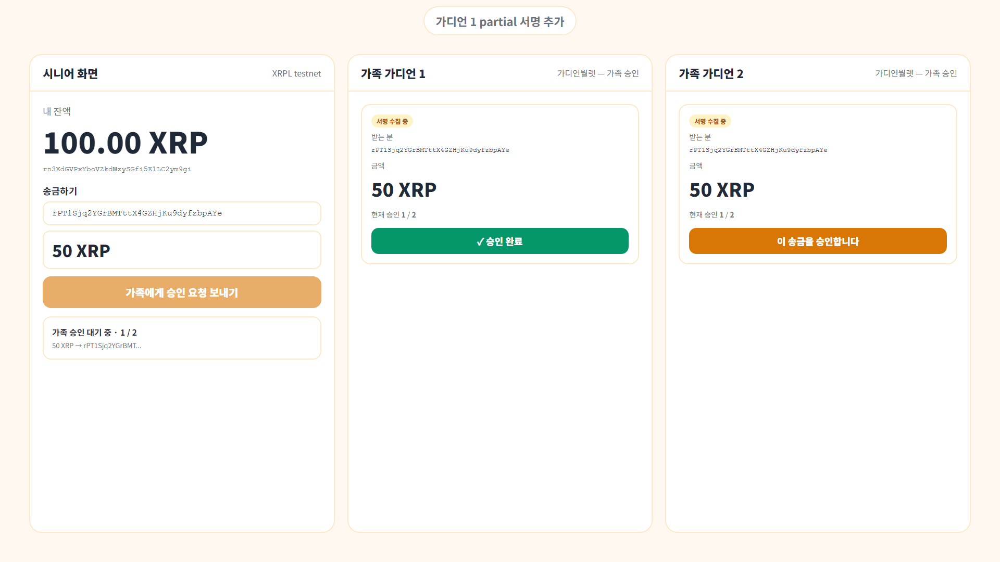
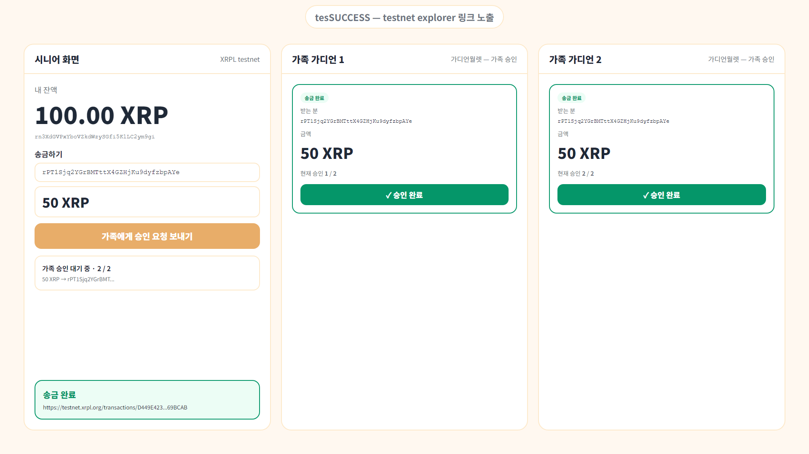
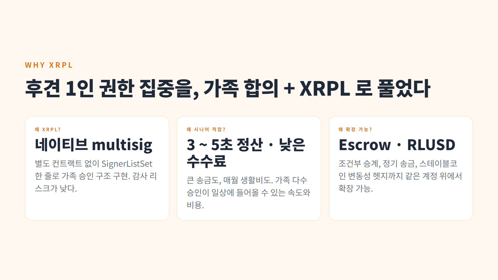

# 가디언월렛 (Family Guardian Wallet)

> 인지저하 시기 시니어의 자산을, 가족 2/3 승인이 있어야만 인출되는 XRPL 네이티브 멀티시그 지갑.

[](https://program.xrplkorea.org/)
[](https://xrpl.org/)

<p align="center">
  
</p>

## KFIP 2026 (Korea Financial Innovation Program 2026) 참가작

본 프로젝트는 **XRPL Korea 가 주관하는 [Korea Financial Innovation Program 2026](https://program.xrplkorea.org/)** 에 **개인 참가작**으로 출전한다. KFIP 는 XRPL 기반의 핀테크 혁신 프로젝트가 한국 금융 시장에 기여할 수 있도록 사업화·법무·입주를 지원하는 프로그램이다.

| 항목 | 내용 |
|---|---|
| 공식 사이트 | <https://program.xrplkorea.org/> |
| 1차 서류 제출 마감 | 2026-05-13 (수) 23:59 |
| 본선 진출 발표 | 2026-05-27 |
| Final Pitch Day | 2026-06-25 · Two IFC Seoul |
| 평가 키워드 | 어떤 문제 · 누구를 위한 · 왜 XRPL · 사업 발전 가능성 · 메인넷 또는 이에 준하는 PoC 흐름 |

가디언월렛은 XRPL 의 네이티브 multisig (`SignerListSet` · `multisign`) 으로 별도 컨트랙트 없이 가족 2/3 승인 구조를 구현한다. 본선 진출 시 **메인넷 트랜잭션 시연 + 태평양 법률 자문을 활용한 규제 검토 + 시니어 인지건강 앱 ‘매일 두뇌건강’ 사용자군 대상 베타 시나리오** 로 확장한다.

## 데모 영상 (1분 45초)

> 🎬 **YouTube:** _업로드 후 URL 추가 예정_
>
> 영상 흐름: Title → Problem (초고령사회 · 회색 지대) → Solution (가족 2/3 승인) → DemoFlow (시연 모드 한 화면 분할 시뮬레이션) → Differentiator (왜 XRPL) → CTA. 결과 카드에는 실제 testnet `SignerListSet` tx hash (`D449E423...`) 가 노출된다.

## 핵심 흐름 (시연 영상 발췌)

### 1. Problem — 지금의 금융은 시니어를 못 지킨다


한국은 2025 년 초고령사회로 진입했고, 인지저하 초기와 후견 개시 사이의 ‘회색 지대’에 보이스피싱 · 자산 탈취 · 가족 분쟁 위험이 집중된다. 본인인증 · OTP 만으로는 약해진 의사결정을 보호하지 못한다.

### 2. Solution — 가족 2/3 승인이 있어야 자산이 움직인다


XRPL 네이티브 SignerListSet 으로 시니어 계정에 가족 가디언 3 명을 등록 (quorum=2). 송금 시 가족 가디언 2 명이 승인해야 트랜잭션이 testnet 에 제출된다.

### 3. 시연 모드 — 한 화면에서 시니어 / 가족 2 명 동시 진행


`/?demo=1` 로 진입하면 한 화면에 세 역할이 분할 표시된다. 시니어가 송금 요청을 만들면 가디언 화면에 카드가 1.5 초 안에 나타나고, 가디언 2 명이 차례로 승인하면 서버가 자동으로 두 partial 서명을 `multisign` 으로 결합한다.

### 4. tesSUCCESS — testnet explorer 링크 노출


`submitAndWait` 응답이 `tesSUCCESS` 면 시니어 화면에 explorer 링크가 즉시 등장한다. 한 번의 흐름이 진짜 testnet 트랜잭션으로 끝까지 도는 것을 심사위원이 직접 클릭해 확인할 수 있다.

### 5. Why XRPL — 후견 1인 권한 집중을 가족 합의 + XRPL 로 풀었다


별도 컨트랙트가 없어 감사 리스크가 낮다. 3 ~ 5 초 정산 · 낮은 수수료로 일상 송금에도 적합하다. Escrow · RLUSD 를 같은 계정 위에서 이어 쓸 수 있어 조건부 승계 · 정기 송금 · 변동성 헷지로 확장 가능하다.

## 요구사항

- Node.js 20 이상
- 인터넷 연결 (testnet faucet 호출)

## 사전 준비

```bash
npm install
npm --prefix web install
cp .env.example .env
```

`.env` 의 시니어 / 가디언 키는 1 단계 스크립트가 자동으로 채워 넣는다.

## 1 단계 — testnet 멀티시그 코어 검증 (CLI)

testnet 위에서 가디언 1 명 서명은 거부, 2 명 서명은 성공하는 흐름을 콘솔로 보여준다.

```bash
npm run create-accounts   # 시니어 + 가디언 3 명 testnet 계정 생성, .env 자동 작성
npm run setup-signers     # 시니어 계정에 SignerListSet (quorum=2, weight=1) 등록
npm run demo              # 1 명 서명(실패) → 2 명 서명(성공) testnet 제출
```

성공하면 마지막에 testnet explorer 링크가 출력된다.

## 2 단계 — 웹 데모

```bash
npm run dev
```

- 백엔드: `http://localhost:4000` (Express)
- 프론트엔드: `http://localhost:5173` (Vite + React + Tailwind, `/api` 자동 프록시)

라우팅 (모두 같은 포트):

| URL | 화면 |
|---|---|
| `/` | 시연용 진입 화면 |
| `/?role=senior` | 시니어 — 잔액 · 가디언 목록 · 송금 요청 |
| `/?role=guardian1` | 가족 가디언 1 번 |
| `/?role=guardian2` | 가족 가디언 2 번 |
| `/?role=guardian3` | 가족 가디언 3 번 |
| `/?demo=1` | 시연 모드 — 시니어 + 가디언 1 + 가디언 2 한 화면 분할 |

### 데모 흐름 (영상 촬영용)

1. `/?demo=1` 한 화면에서 세 역할이 동시에 보인다.
2. 시니어가 받는 분 주소 · 금액을 입력하고 “가족에게 승인 요청 보내기” 클릭.
3. 가디언 1, 2 화면에 승인 카드가 1.5 초 내로 나타난다.
4. 가디언 1 이 “이 송금을 승인합니다” 클릭. 카드 상태가 1/2 로 변한다.
5. 가디언 2 가 승인하면 서버가 두 partial 서명을 `multisign` 으로 결합 → `submitAndWait` 으로 testnet 에 제출.
6. 시니어 화면에 “송금 완료” + testnet explorer 링크가 노출된다.

## 백엔드 엔드포인트

- `GET  /api/health`
- `GET  /api/config` — 시니어 주소 · 네트워크 · 가디언 라벨 (시드 미노출)
- `GET  /api/account/:address` — 잔액 · 시퀀스
- `GET  /api/account/:address/signers` — SignerList · quorum
- `POST /api/signing-requests` — 시니어 송금 요청 생성 (autofill 포함)
- `GET  /api/signing-requests` — 전체 요청 목록 (가디언 폴링)
- `GET  /api/signing-requests/:id`
- `POST /api/signing-requests/:id/sign` — 가디언 partial 서명 추가, quorum 충족 시 자동 결합 · 제출

## 보안 / PoC 단순화 노트

- 가디언 시드는 **서버 환경변수** 에만 두고 프론트로 절대 내려보내지 않는다. multisign 서명도 서버 측에서 수행.
- 실제 서비스에서는 가디언 디바이스에서 서명 후 서버에 partial 블롭만 전달하는 구조로 분리해야 한다. PoC 단계의 단순화.
- in-memory 송금 요청 저장소. 서버 재시작 시 초기화.
- testnet faucet 발급액과 SignerList reserve 합산 때문에 큰 금액 송금이 잔액 부족으로 실패할 수 있다. 폼에서 50 XRP 정도로 시작하면 안전하다.

## 배포 — Render Free Web Service

1. 본 저장소를 GitHub 에 push (이미 완료).
2. <https://render.com> 가입 → New → Blueprint → 본 저장소 선택.
3. `render.yaml` 이 자동 인식된다.
4. Environment 탭에서 `.env` 의 11 개 값 그대로 입력 (testnet 전용 시드).
5. Deploy. 발급되는 `https://guardian-wallet-xxxx.onrender.com` 이 데모 링크.

Render Free 인스턴스는 트래픽이 없으면 잠들었다가 첫 요청에 30 ~ 50 초 깨어난다. 시연 영상 촬영 직전에 한 번 호출해 두면 된다.

## 파일 구조

```
family-guardian-wallet/
├── src/
│   ├── xrpl/                # XRPL 멀티시그 코어 (재사용)
│   ├── scripts/             # 1 단계 CLI
│   └── server/              # Express API + lib
├── web/                     # 프론트엔드 (Vite + React + Tailwind)
├── docs/
│   ├── images/              # README 갤러리
│   └── progress.md          # 내부 진행 일지
├── render.yaml              # Render 배포 청사진
└── README.md
```

## 참고

- KFIP 2026: <https://program.xrplkorea.org/>
- XRPL 멀티시그 공식 문서: <https://xrpl.org/docs/concepts/accounts/multi-signing>
- xrpl.js: <https://js.xrpl.org/>
